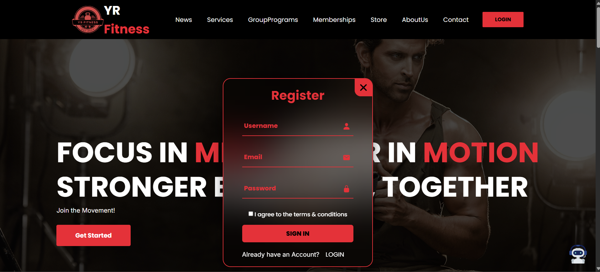
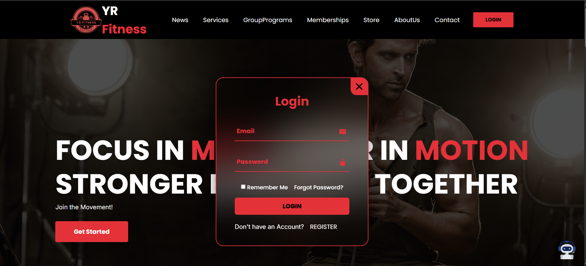
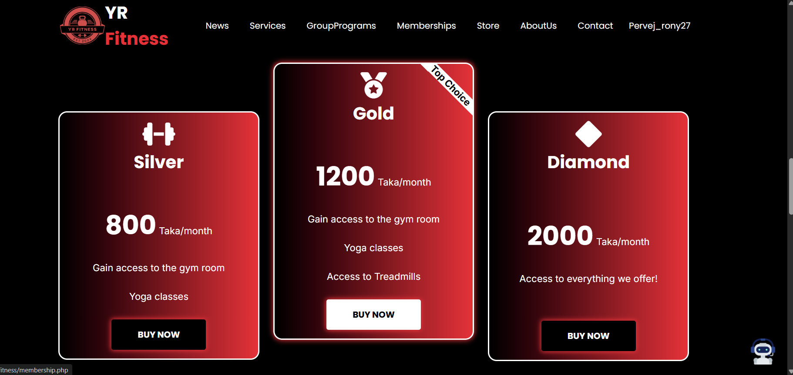
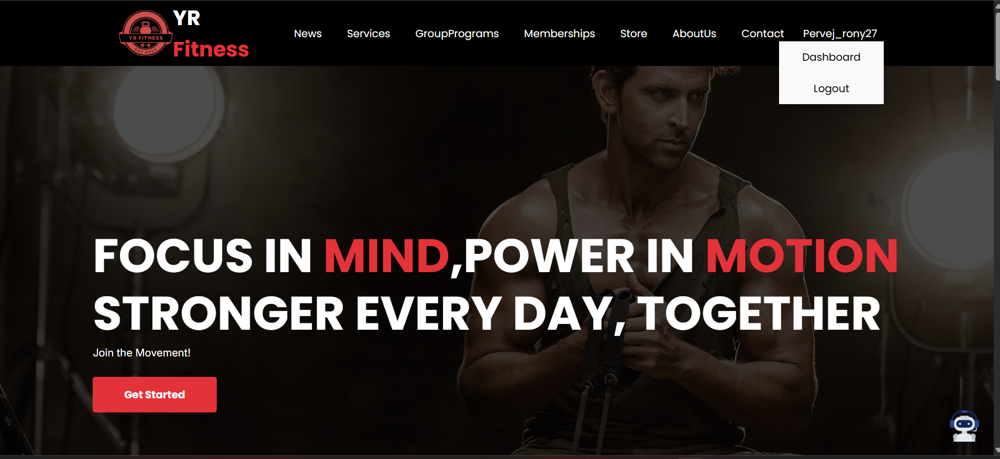
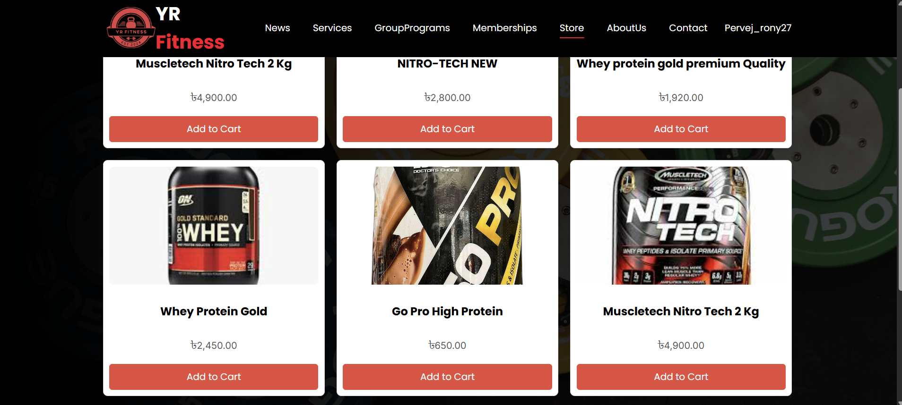
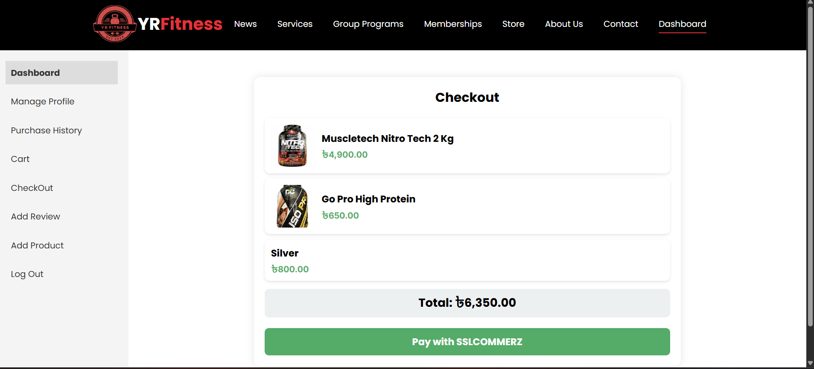
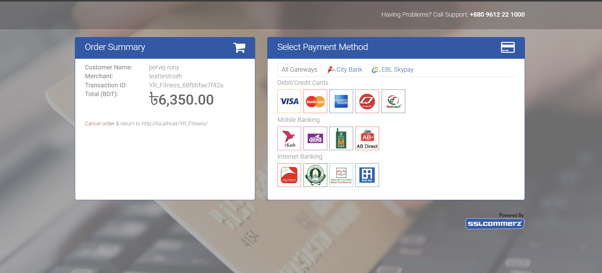
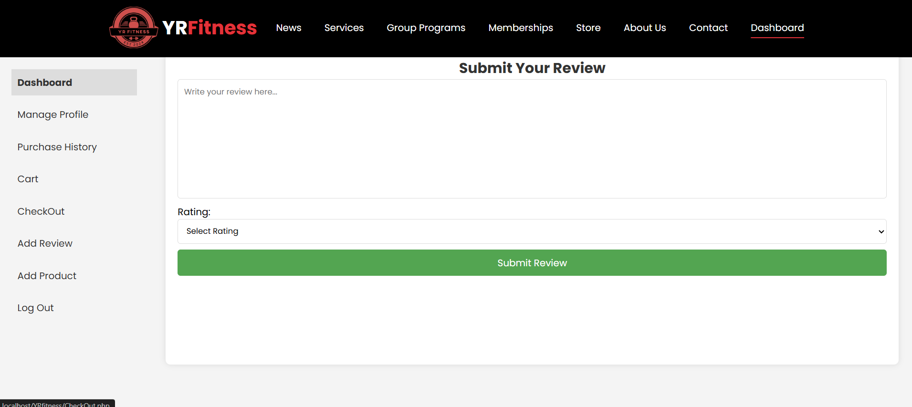
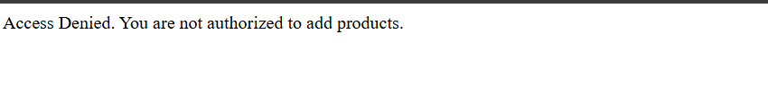

# YR_Fitness 🏋️‍♂️

  

**YR_Fitness** is a **gym management web application** designed to digitalize fitness center operations while enhancing user experience.  
Developed as part of the **Integrated Project course** at **BAIUST, Bangladesh**.

---

## 🔗 Live Demo
*(If hosted online, replace the link below)*  
[Live Demo](http://your-live-demo-link.com)

---

## 🏋️‍♂️ Project Overview
YR_Fitness provides an **interactive dashboard** for users to:
- Manage personal profiles
- Explore and join **group fitness programs**
- Purchase gym products through an integrated **store**
- Subscribe to **membership plans** via a **SaaS-based system**

The system combines **user convenience** with **administrative control**, making it suitable for **real-world gym management**.

---

## ⚙️ Key Features & Screenshots

### **1️⃣ Register Page**
Users can create a new account to access the platform.  


### **2️⃣ Login Page**
Registered users can securely login to access dashboard and services.  


### **3️⃣ Membership Page**
Users can view and subscribe to monthly, quarterly, or yearly membership plans.  


### **4️⃣ After Login Dashboard**
Shows personalized dashboard after login with welcome message and quick navigation.  


### **5️⃣ Store Page**
Browse and purchase gym-related products. Users can add items to cart or wishlist.  


### **6️⃣ Dashboard Cart**
View products added to cart before purchase. Users can edit quantities or remove items.  


### **7️⃣ SSLCOMMERZ Payment Integration**
Secure payment gateway integration for processing purchases.  


### **8️⃣ Review Page**
Users can leave feedback and reviews for products or services.  


### **9️⃣ Add Product (Admin Only)**
Admin can add new products to the store via this interface.  


---

## 🧰 Tools & Technologies Used
- **Frontend:** HTML, CSS, JavaScript  
- **Backend:** PHP  
- **Database:** MySQL  
- **Server Environment:** XAMPP  
- **Development Tool:** Visual Studio Code  
- **Database Management:** phpMyAdmin  
- **Model:** SaaS (Software as a Service)

---

## 📦 Installation / Setup
1. Clone the repository:
   ```bash
   git clone https://github.com/yourusername/YR_Fitness.git
